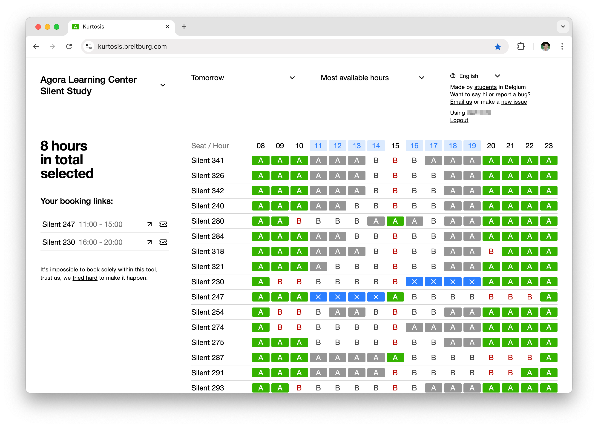

# Kurtosis

[](https://kurtosis.breitburg.com)
[](https://github.com/breitburg/kurtosis/issues)

Super-snappy tool for power users of [KU Leuven Reservation Tool (KURT)](http://www.kuleuven.be/kurt) built by students. Easily view the availability of seats and rooms in Agora, Erasmushuis, CBA, EBIB and other KU Leuven libraries.



## Quick Start

### For Users

1. Visit [kurtosis.breitburg.com](https://kurtosis.breitburg.com)
2. Enter your R-number, U-number, or B-number (found on your student card as `Gebruikersnaam`)
3. Select a library and date (up to 7 days ahead)
4. Browse available time slots and select the ones you want
5. Click generated booking links to reserve on the official KURT system

**Requirements:**
- Valid KU Leuven R-number, U-number, or B-number
- Active KU Leuven account (student, staff, or guest)

### For Developers

```bash
# Clone the repository
git clone https://github.com/breitburg/kurtosis.git
cd kurtosis

# Install dependencies
bun install

# Start development server
bun run dev

# Build for production
bun run build
```

## Development

### Available Scripts

```bash
bun run dev      # Start development server
bun run build    # Build for production
bun run lint     # Run ESLint
bun run preview  # Preview production build
```

### Internationalization

The application supports multiple languages with **Dutch as the default**. Currently supported languages:

- 🇳🇱 **Nederlands** (Dutch) - Default
- 🇬🇧 **English**
- 🇫🇷 **Français** (French)
- 🇩🇪 **Deutsch** (German)

#### Adding a New Language

The application uses **automatic language detection** from available translation files. To add support for a new language:

1. **Create a translation file** in `src/i18n/locales/[lang-code].json`
   ```bash
   # Example: adding Spanish
   cp src/i18n/locales/en.json src/i18n/locales/es.json
   ```

2. **Translate all text strings** in the new JSON file
   - Keep the same JSON structure
   - Translate only the values, not the keys
   - Use `{{variable}}` syntax for interpolated values
   - **Important**: Add a `languageDisplayName` key with the language's native name:
   ```json
   {
     "languageDisplayName": "Español",
     "welcome": "Bienvenido",
     ...
   }
   ```

3. **Add the language import** to `src/i18n/i18n.js`:
   ```javascript
   import es from './locales/es.json';
   
   const resources = {
     // ... existing languages
     es: {
       translation: es
     }
   };
   ```

That's it! The `LanguageSwitcher` component automatically detects available languages from the i18n resources and displays them using their native names from the `languageDisplayName` key. Date formatting uses the raw language code (e.g., 'es') for native localization.

The language preference is automatically saved to localStorage and will persist across browser sessions.

### Working with Claude Code

This repository includes a `CLAUDE.md` file with detailed guidance for [Claude Code](https://claude.ai/code) when working with this codebase.

## Legal & Disclaimer

**Not affiliated with KU Leuven** - This is an independent student project.

While we've shared this tool with KURT staff and received no objections, it is not officially approved or endorsed by KU Leuven. Use responsibly and don't abuse the system. We're not responsible for any consequences of using this tool.

## Contributing

1. Fork the repository
2. Create a feature branch (`git checkout -b feature/amazing-feature`)
3. Commit your changes (`git commit -m 'Add amazing feature'`)
4. Push to the branch (`git push origin feature/amazing-feature`)
5. Open a Pull Request

## Support

- **Email**: [kurtosis@breitburg.com](mailto:kurtosis@breitburg.com)
- **Issues**: [GitHub Issues](https://github.com/breitburg/kurtosis/issues/new)

## License

This project is open source. See the repository for license details.